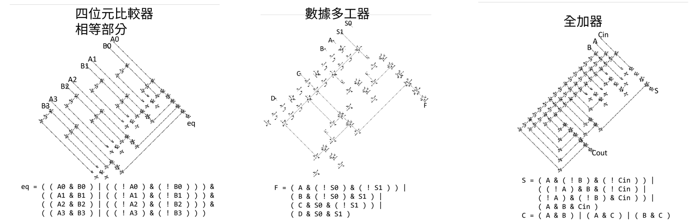

# useing boolen function generate digital circuit in conway's life game
使用布林函式在康威生命遊戲中產生數位電路 
本專案的電路元件使用Nicholas Carlini在2020/04/01年發布在他個人網站上的設計[他的文章](https://nicholas.carlini.com/writing/2020/digital-logic-game-of-life.html)  
[English document](./README.md) | 中文文檔

# 介紹
本專案為golly模擬器中的外掛腳本，可以藉由輸入布林函式在康威生命遊戲中生成數位電路。 
下面是生成的案例 
 
上方為組合電路名稱，中間是生成的結果，下方是輸入的布林函式 
(另外，如果你想在golly中輸出圖片的話你可以參考[ golly-save-image](https://github.com/rlongdragon/golly-save-image))

# 開始使用
## 安裝
本次專案式做為康威生命遊戲模擬器golly的外掛腳本，所以在開始使用前你必須先安裝golly模擬器。(如果你已經安裝好了你可以跳過這步) 
你可以在[sourceforge](https://sourceforge.net/projects/golly/)下載golly模擬器。下載後解壓縮，你會得到一個golly的資料夾，裡面有golly.exe，這就是golly模擬器了。 

## 載入腳本
在golly的資料夾中有一個scripts的資料夾，這個資料夾就是用來放置外掛腳本的地方。 
golly可以使用python或是lua來撰寫外掛腳本，本次專案使用python撰寫，所以你必須將本次專案的[檔案](/src/generate_circuit)放置在scripts資料夾中的python資料夾中。 
至此，你就可以開始使用了。 

## 執行腳本
執行分兩個步驟，先使用python執行[生成電路設計圖](/src/generate_circuit/generateLayout.py)，再在golly中執行[放置電路](/src/generate_circuit/putObjs.py)。 
執行[生成電路設計圖](/src/generate_circuit/generateLayout.py)的時候你需要填入*輸入端*、*輸出端*、*布林函式*。 
你可以在[範例](./Example.txt)中看到範例。 

生成後在golly中點擊[putObjs.py](/src/generate_circuit/putObjs.py)就會在golly中生成電路了。 