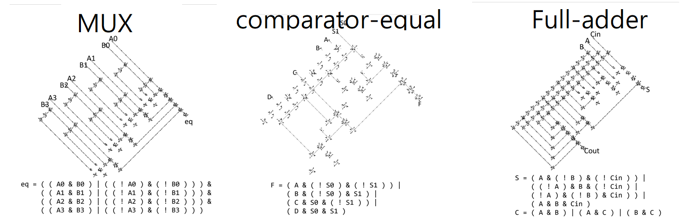

# Generate Digital Circuits in Conway's Game of Life using Boolean Functions
This project is a plugin script for the Golly simulator, allowing users to generate digital circuits in Conway's Game of Life by inputting Boolean functions. The circuit components are based on the designs by Nicholas Carlini, as shared in his [article](https://nicholas.carlini.com/writing/2020/digital-logic-game-of-life.html) from April 1, 2020. 
English document | [中文文檔](README-zh.md)

## Introduction
This script acts as a plugin for the Golly simulator for Conway's Game of Life. By inputting a Boolean function, it generates a corresponding digital circuit within the Game of Life.

Here's an example of the generated output:

The top label represents the name of the combinational circuit, the middle shows the generated result, and the bottom showcases the input Boolean function.

(Note: If you wish to export images from Golly, you can refer to [golly-save-image](https://github.com/rlongdragon/golly-save-image)).

## Getting Started
### Installation
Before starting, you need to have the Golly simulator installed. If you've already got this set up, you can skip this step.

You can download the Golly simulator from [sourceforge](https://sourceforge.net/projects/golly/). After downloading, unzip the package. You will find a folder named 'golly' containing 'golly.exe', which is the Golly simulator.

### Load the Script
Inside the 'golly' folder, there's a sub-folder named 'scripts'. This is where plugins or scripts for Golly are stored. 

Golly supports plugins written in either Python or Lua. For this project, we're using Python. Therefore, place the [files](/src/generate_circuit) of this project inside the 'python' folder within 'scripts'.

With that done, you're ready to use the plugin.

### Execution
The execution process is in two steps:

1. Execute [generateLayout.py](/src/generate_circuit/generateLayout.py) using Python. While running this script, you'll need to input the *Inputs*, *Outputs*, and the *Boolean Function*. You can check out the [example](./Example.txt) for reference.
2. In Golly, run [putObjs.py](/src/generate_circuit/putObjs.py) to place the circuit within the simulator.

Once done, Golly will display the generated digital circuit based on the Boolean function you provided.